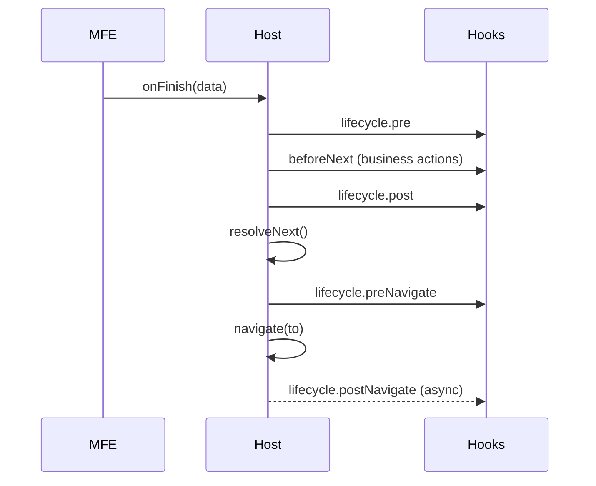
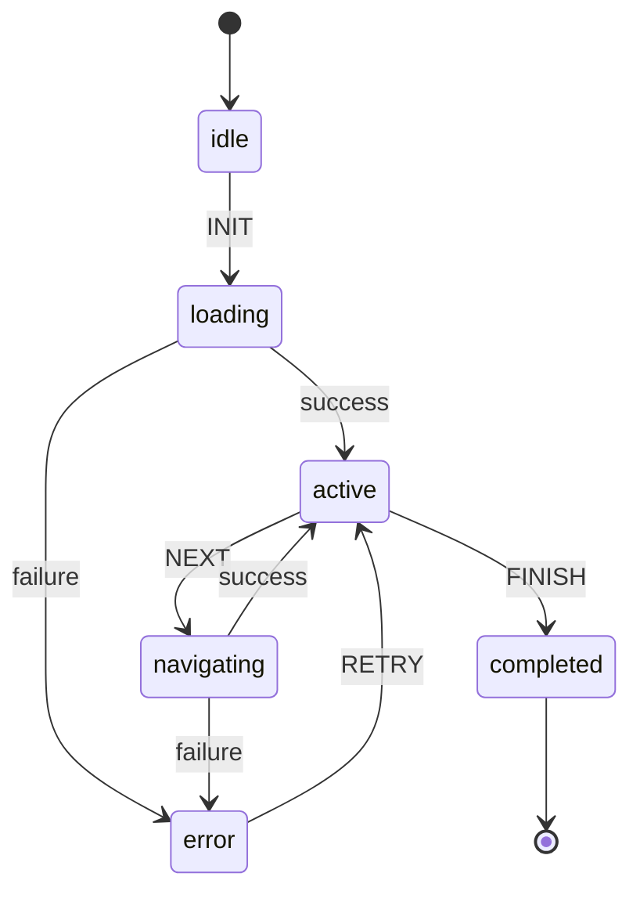
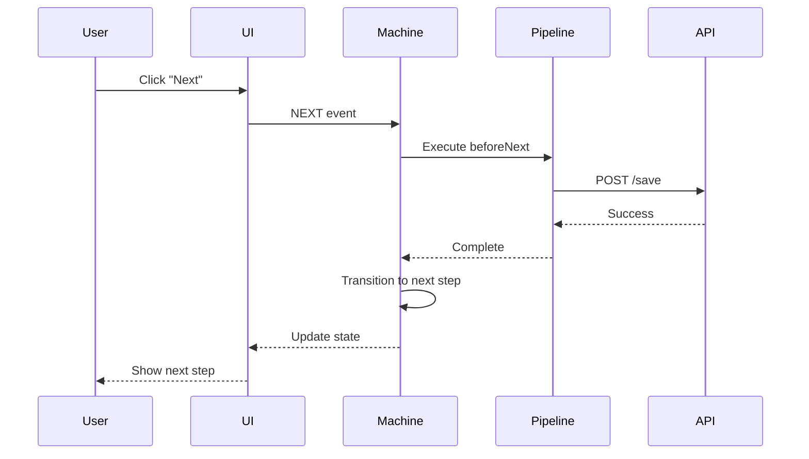
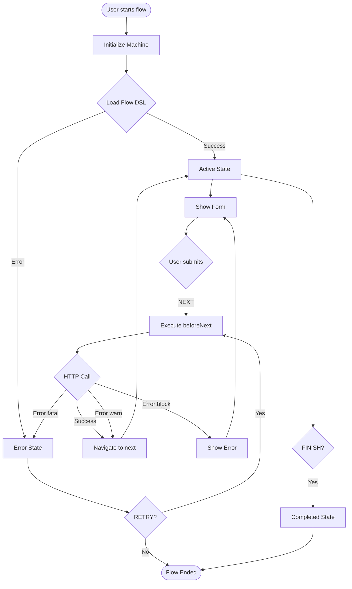

# 🚀 Advanced Flow DSL Concepts

This document outlines advanced concepts and future enhancements for the XFlows DSL, based on extensive research and prototyping.

## 📋 Table of Contents

- [Actions & Pipelines](#actions--pipelines)
- [Dynamic Transitions](#dynamic-transitions)
- [Lifecycle Hooks](#lifecycle-hooks)
- [Back Navigation](#back-navigation)
- [Visual Diagrams](#visual-diagrams)
- [Implementation Roadmap](#implementation-roadmap)

---

## Actions & Pipelines

### Inter-Step Actions (`beforeNext`)

The Flow DSL supports executing actions between steps through the `beforeNext` pipeline.

#### Global Actions Registry

```json
{
  "id": "product-7006",
  "actions": {
    "verifyQuickQuote": {
      "type": "http",
      "method": "POST",
      "url": "/v1/products/{{session.productCode}}/quickquote/{{session.quickQuoteId}}/verify",
      "body": { "agentId": "{{session.agentId}}" },
      "timeoutMs": 5000,
      "retry": { "max": 1, "backoffMs": 400 },
      "cacheTtlMs": 60000,
      "expect": { "status": 200, "schema": "QuickQuoteVerifyResponse" },
      "mapResult": {
        "session.verificationStatus": "$.status",
        "session.verificationCode": "$.code"
      }
    }
  },
  "states": {
    "quickquote": {
      "beforeNext": [
        { "use": "verifyQuickQuote" },
        { 
          "type": "http", 
          "method": "GET", 
          "url": "/v1/audit/{{session.productCode}}" 
        }
      ],
      "view": { "moduleId": "quote-form" },
      "on": {
        "NEXT": "underwriting"
      }
    }
  }
}
```

#### Action Types

##### HTTP Actions

```json
{
  "type": "http",
  "method": "POST",
  "url": "/api/endpoint",
  "headers": {
    "Content-Type": "application/json"
  },
  "body": {
    "data": "{{context.user.id}}"
  },
  "timeoutMs": 5000,
  "retry": {
    "max": 3,
    "backoffMs": 1000
  },
  "cacheTtlMs": 30000,
  "expect": {
    "status": 200,
    "schema": "ResponseSchema"
  },
  "mapResult": {
    "context.result": "$.data",
    "context.status": "$.status"
  }
}
```

##### Future Action Types

```json
{
  "type": "delay",
  "durationMs": 2000
}

{
  "type": "event",
  "event": "USER_ACTION_COMPLETED",
  "payload": { "stepId": "{{currentStep}}" }
}

{
  "type": "signalr",
  "method": "SendNotification",
  "args": ["{{context.user.id}}", "Step completed"]
}
```

---

## Dynamic Transitions

### Conditional Navigation

Instead of static `next` transitions, flows can use dynamic resolution based on context:

```json
{
  "quickquote": {
    "beforeNext": [{ "use": "verifyQuickQuote" }],
    "on": {
      "NEXT": {
        "target": {
          "default": "underwriting",
          "conditions": [
            {
              "if": "{{context.session.verificationStatus === 'NEEDS_USER_ACTION'}}",
              "to": "manual-verification"
            },
            {
              "if": "{{context.session.verificationStatus === 'REJECTED'}}",
              "to": "quickquote",
              "effects": [
                { "assign": { "context.session.retryFlag": true } }
              ]
            }
          ]
        }
      }
    }
  }
}
```

### Condition Formats

#### JSON Logic (Recommended)

```json
{
  "if": { 
    "===": [ 
      { "var": "context.session.verificationStatus" }, 
      "NEEDS_USER_ACTION" 
    ] 
  },
  "to": "manual-verification"
}
```

#### String Legacy (Auto-converted)

```json
{
  "if": "{{context.session.verificationStatus === 'NEEDS_USER_ACTION'}}",
  "to": "manual-verification"
}
```

### Effects

```json
{
  "effects": [
    { "assign": { "context.session.flag": "value" } },
    { "clear": ["context.tempData"] }
  ]
}
```

---

## Lifecycle Hooks

### Hook System

The lifecycle hook system provides fine-grained control over step execution:

```json
{
  "quickquote": {
    "lifecycle": {
      "pre": [
        { "type": "http", "method": "POST", "url": "/v1/track/step-start" }
      ],
      "post": [
        { "use": "verifyQuickQuote" }
      ],
      "preNavigate": [
        { "type": "http", "method": "POST", "url": "/v1/audit/step-complete" }
      ],
      "postNavigate": [
        { "type": "http", "method": "POST", "url": "/v1/async/notify" }
      ]
    },
    "on": {
      "NEXT": {
        "target": {
          "default": "underwriting",
          "conditions": [
            {
              "if": "{{context.session.verificationStatus === 'NEEDS_USER_ACTION'}}",
              "to": "manual-verification"
            }
          ]
        }
      }
    }
  }
}
```

### Hook Execution Order



### Hook Capabilities

| Hook | Purpose | Can Mutate Context | Can Change Navigation | Blocks Navigation | Typical Use |
|------|---------|-------------------|---------------------|------------------|-------------|
| pre | Prepare/validate/enrich | ✅ | ❌ | ✅ | Final validation, normalization |
| post | Actions dependent on previous results | ✅ | ❌ | ✅ | Additional enrichment |
| preNavigate | Last filter/override | ✅ | ✅ | ✅ | Abort/redirect, critical logging |
| postNavigate | Non-critical side-effects | ❌ | ❌ | ❌ | Analytics, notifications |

---

## Back Navigation

### Simple Back Navigation

```json
{
  "underwriting": {
    "view": { "moduleId": "underwriting-form" },
    "allowBack": true,
    "on": {
      "NEXT": "personal-data",
      "BACK": "quickquote"
    }
  }
}
```

### Advanced Back Navigation (Future)

```json
{
  "underwriting": {
    "back": {
      "allowed": ["quickquote", "manual-verification"],
      "default": "quickquote",
      "policy": { 
        "revalidateOnReturn": true, 
        "clearForwardData": true 
      }
    },
    "view": { "moduleId": "underwriting-form" },
    "on": {
      "NEXT": "personal-data"
    }
  }
}
```

---

## Visual Diagrams

### State Machine Diagrams



### Sequence Diagrams



### Flow Diagrams



---

## Implementation Roadmap

### Phase 1: Core Actions & Dynamic Transitions
- [ ] Extend FlowSchema with actions and beforeNext
- [ ] Implement HTTP action runner
- [ ] Add conditional transition resolution
- [ ] Basic effects (assign/clear)
- [ ] Backward compatibility with existing flows

### Phase 2: Advanced Features
- [ ] Lifecycle hooks system
- [ ] Retry/backoff mechanisms
- [ ] Action caching
- [ ] Metrics and observability
- [ ] Error handling policies

### Phase 3: Extended Capabilities
- [ ] Additional action types (delay, event, signalr)
- [ ] Advanced back navigation
- [ ] Parallel action execution
- [ ] Circuit breaker patterns
- [ ] Security hardening

### Phase 4: Enterprise Features
- [ ] Expression evaluator security
- [ ] i18n key support
- [ ] DSL integrity validation
- [ ] Visual flow editor integration
- [ ] Performance optimization

---

## Security Considerations

### Risk Mitigation

| Risk | Initial Mitigation | Future Mitigation |
|------|-------------------|------------------|
| Arbitrary expressions | Limit to current usage patterns | Safe parser / whitelist operators |
| Unauthorized external calls | Validate `/v1/` prefix / logging | Domain allowlist |
| Sensitive data in logs | Selective redaction | Masking policy |
| Action overriding | Validate duplicates in actions | `override: true` flag |

### URL Restrictions

- URLs must be relative (start with `/`)
- No `http://` or `https://` allowed
- Authentication tokens injected outside DSL

---

## Migration Strategy

### Legacy Flow Compatibility

| Flow Type | Required Action |
|-----------|-----------------|
| Legacy simple | None (remains valid) |
| Flow with technical verification step | Replace step with `beforeNext` + conditional |
| Future complex flows | Adopt global `actions` for DRY |

### Migration Checklist

- [ ] Move HTTP logic to `actions.verifyX`
- [ ] Reference in `beforeNext`
- [ ] Add condition in `next` if branching required
- [ ] Remove technical view if no UI needed

---

## Metrics & Observability

### Key Metrics

| Metric | Description |
|--------|-------------|
| `dsl_action_duration_ms{action}` | Action execution time |
| `dsl_action_fail_total{action,reason}` | Errors by type |
| `dsl_next_condition_match_total{step}` | Conditions that evaluate to true |
| `dsl_next_resolution_fail_total{flow}` | Cases with no valid transition |
| `dsl_action_cache_hit_total` | Cache usage |

### Debug Panel Integration

```json
{
  "actionsTrace": [
    { 
      "ts": 1696170000000, 
      "action": "verifyQuickQuote", 
      "durationMs": 143, 
      "status": "OK" 
    }
  ],
  "nextResolution": {
    "step": "quickquote",
    "matchedCondition": 0,
    "target": "manual-verification"
  }
}
```

---

## Open Questions

| Question | Pending Decision |
|----------|------------------|
| Expose action results to expressions? | Proposed: `results.<id>` in Phase 2 |
| Support multiple branching? | Not in Phase 1 |
| Parallel actions? | Sequential in Phase 1 (sufficient) |
| Circuit breaker (consecutive failures)? | Phase 3+ |
| DSL integrity via hash? | Phase 4 |

---

## References

- [Flow DSL Reference](./flow-dsl.md)
- [API Reference](./api-reference.md)
- [Architecture Guide](./architecture.md)
- [Best Practices](./best-practices.md)

---

**Last Updated:** October 2025
