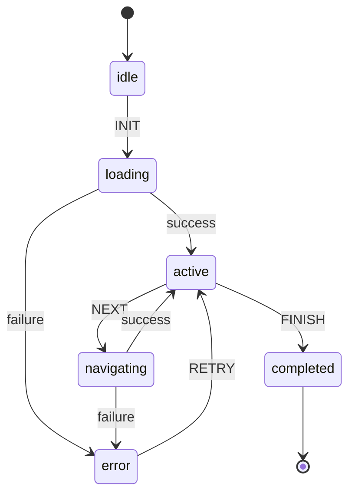
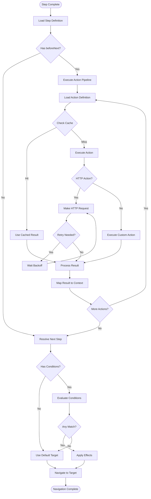
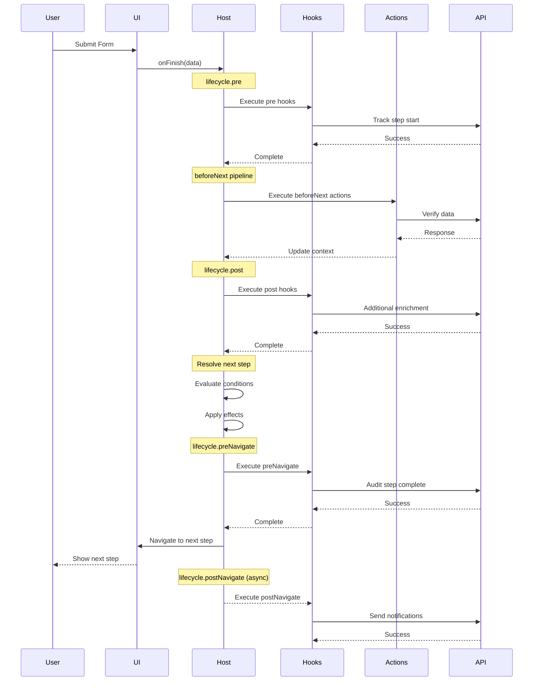
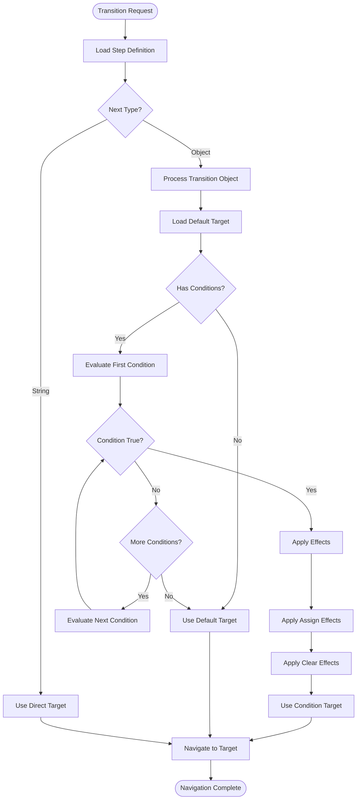
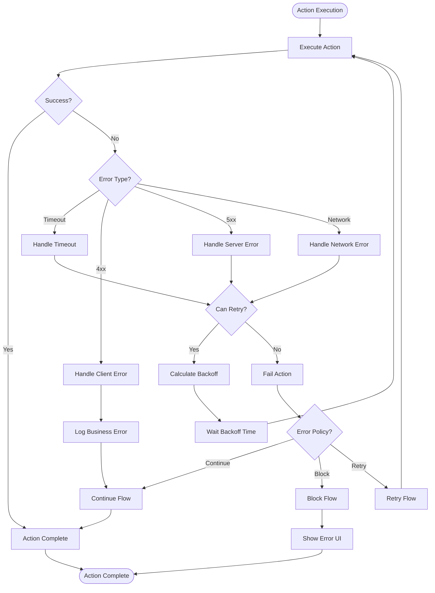
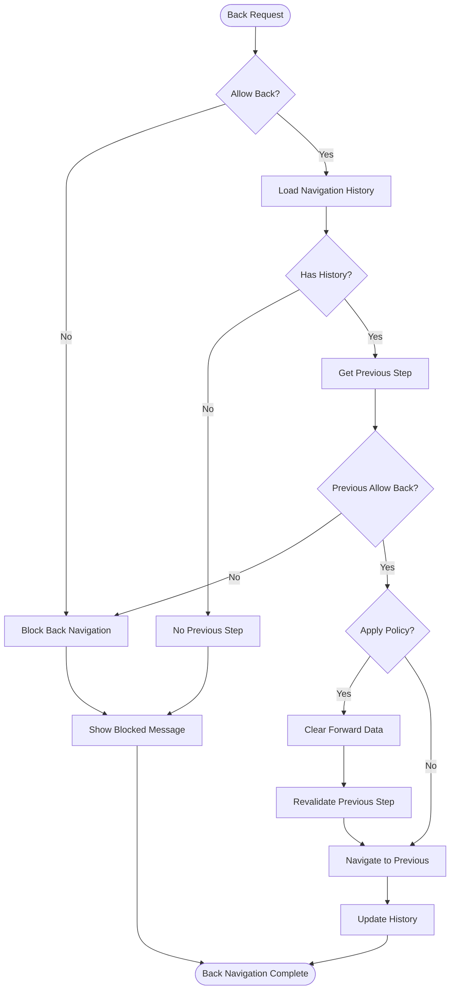
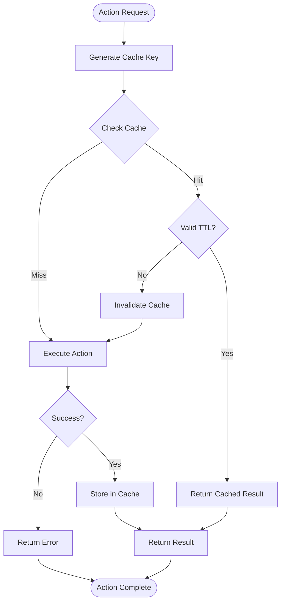
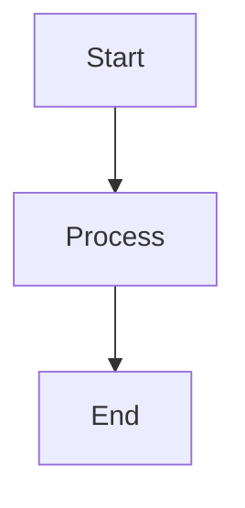

# 📊 XFlows Visual Diagrams

This section contains all visual diagrams of the state machine and its flows.

---

## 📚 Available Diagrams

### Core Diagrams

- **[State Machine Overview](#state-machine-overview)** ⭐
- **[Action Pipeline Flow](#action-pipeline-flow)**
- **[Lifecycle Hooks](#lifecycle-hooks)**
- **[Dynamic Transitions](#dynamic-transitions)**
- **[Error Handling](#error-handling)**

---

## State Machine Overview

Visual representation of the core XFlows state machine with all states and transitions.



### State Descriptions

| State | Description | Actions |
|-------|-------------|---------|
| `idle` | Initial state, waiting for flow initialization | Initialize context |
| `loading` | Loading flow definition and dependencies | Load DSL, validate schema |
| `active` | Flow is running, user can interact | Render UI, handle events |
| `navigating` | Executing beforeNext pipeline | Run actions, resolve transitions |
| `error` | Error state with recovery options | Show error UI, handle retry |
| `completed` | Flow finished successfully | Cleanup, final actions |

---

## Action Pipeline Flow

Detailed flow of action execution in the `beforeNext` pipeline.



### Pipeline Components

| Component | Purpose | Configuration |
|-----------|---------|---------------|
| **Action Loader** | Load action definitions | Global actions or inline |
| **Cache Layer** | Avoid redundant executions | `cacheTtlMs` |
| **HTTP Client** | Make API calls | Method, URL, headers, body |
| **Retry Logic** | Handle transient failures | `retry.max`, `retry.backoffMs` |
| **Result Mapper** | Update context | `mapResult` object |
| **Condition Evaluator** | Dynamic transitions | JSON Logic expressions |

---

## Lifecycle Hooks

Visual representation of the lifecycle hook execution order.



### Hook Types

| Hook | Timing | Purpose | Can Block |
|------|--------|---------|-----------|
| **pre** | Before any processing | Preparation, validation | ✅ |
| **beforeNext** | After pre, before transition | Business logic | ✅ |
| **post** | After actions, before navigation | Additional processing | ✅ |
| **preNavigate** | Before navigation | Final checks, overrides | ✅ |
| **postNavigate** | After navigation | Side effects, analytics | ❌ |

---

## Dynamic Transitions

Flow of dynamic transition resolution with conditions and effects.



### Condition Types

```json
{
  "conditions": [
    {
      "if": { "===": [{ "var": "status" }, "APPROVED"] },
      "to": "approved-step",
      "effects": [
        { "assign": { "context.flag": "approved" } }
      ]
    },
    {
      "if": { "and": [
        { ">=": [{ "var": "score" }, 80] },
        { "!==": [{ "var": "status" }, "PENDING"] }
      ]},
      "to": "high-score-step"
    }
  ]
}
```

---

## Error Handling

Error handling flow with retry logic and fallback mechanisms.



### Error Policies

| Policy | Description | Use Case |
|--------|-------------|----------|
| **Continue** | Log error, continue flow | Non-critical actions |
| **Block** | Stop flow, show error | Critical validations |
| **Retry** | Retry action with backoff | Transient failures |

### Retry Configuration

```json
{
  "retry": {
    "max": 3,
    "backoffMs": 1000,
    "backoffMultiplier": 2,
    "maxBackoffMs": 10000
  }
}
```

---

## Back Navigation Flow

Flow for handling back navigation with history and validation.



### Back Navigation Policies

```json
{
  "back": {
    "allowed": ["step1", "step2"],
    "default": "step1",
    "policy": {
      "revalidateOnReturn": true,
      "clearForwardData": true,
      "preserveContext": false
    }
  }
}
```

---

## Cache Flow

Action result caching mechanism.



### Cache Configuration

```json
{
  "cacheTtlMs": 60000,
  "cacheKey": "custom-key",
  "cacheInvalidate": ["related-action"]
}
```

---

## How to Use Diagrams

### Viewing in Docsify

Diagrams are automatically rendered in Docsify using Mermaid. They will appear as interactive SVG diagrams.

### Editing Diagrams

1. **Modify the Mermaid code** in the corresponding section
2. **Preview changes** using [Mermaid Live Editor](https://mermaid.live)
3. **Test in Docsify** by serving the documentation locally

### Creating New Diagrams

Use this template for new diagrams:

```markdown
## Your Diagram Title

Brief description of what the diagram shows.



### Explanation

Detailed explanation of each element in the diagram.

### Configuration

Any relevant configuration options or parameters.
```

### Diagram Conventions

- **States**: Use lowercase (`idle`, `active`, `error`)
- **Events**: Use UPPERCASE (`NEXT`, `FINISH`, `RETRY`)
- **Actions**: Use camelCase (`executeAction`, `updateContext`)
- **Conditions**: Use descriptive names (`canProceed`, `hasErrors`)

---

## Tools and Resources

### Mermaid Resources

- [Mermaid Documentation](https://mermaid.js.org/)
- [Mermaid Live Editor](https://mermaid.live)
- [VS Code Extension](https://marketplace.visualstudio.com/items?itemName=bierner.markdown-mermaid)

### Diagram Export

To export diagrams as images:

1. Visit [Mermaid Live Editor](https://mermaid.live)
2. Paste the diagram code
3. Export as PNG, SVG, or PDF

### Integration

Diagrams are integrated into the documentation through:

- **Docsify Mermaid Plugin**: Automatic rendering
- **Syntax Highlighting**: Code blocks with `mermaid` language
- **Interactive Features**: Clickable elements and tooltips

---

## Related Documentation

- [Advanced Concepts](./advanced-concepts.md)
- [Flow DSL Reference](./flow-dsl.md)
- [API Reference](./api-reference.md)
- [Architecture Guide](./architecture.md)

---

<p align="center">
  <strong>Last Updated:</strong> October 2025
</p>
