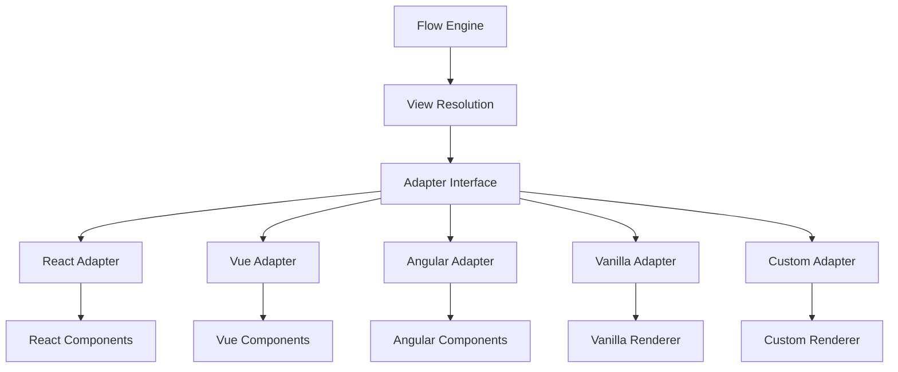

# 🔧 Adapter Development Guide

Learn how to integrate XState Orchestrator with different UI frameworks and create custom adapters.

## 🎯 Overview

Adapters are the bridge between the headless XState Orchestrator core and UI frameworks. The adapter pattern allows the same flow definitions to work across React, Vue, Angular, or any other framework.

## 🏗️ Adapter Architecture



## 📋 Adapter Contract

All adapters implement this interface:

```typescript
// From @xflows/renderer-core
export interface ViewProps {
  flowId: string;
  nodeId: string;
  contextSlice: any;
  send: (event: any) => void;
}

export interface ViewInstance {
  unmount: () => void;
}

export interface ViewFactory {
  (slot: string | undefined, props: ViewProps): ViewInstance;
}

export interface ViewRegistry {
  resolve(moduleId: string): ViewFactory | undefined;
}

export interface HostRenderer {
  mount: (moduleId: string, slot: string | undefined, props: ViewProps) => ViewInstance;
}
```

## ⚛️ React Adapter

The React adapter is the most commonly used adapter. It integrates seamlessly with React's component lifecycle.

### Basic Usage

```tsx
import React, { useEffect, useState } from 'react';
import { createHeadlessHost } from '@xflows/core';
import { createReactRenderer, asReactView } from '@xflows/adapter-react';
import flow from './my-flow.json';

// 1. Define your components
const MyComponent = ({ nodeId, contextSlice, send }) => {
  const [localState, setLocalState] = useState('');

  return (
    <div>
      <h2>My Component [{nodeId}]</h2>
      <input 
        value={localState}
        onChange={(e) => setLocalState(e.target.value)}
      />
      <button onClick={() => send({ type: 'SUBMIT', payload: localState })}>
        Submit
      </button>
    </div>
  );
};

// 2. Register components
const registry = {
  resolve(moduleId: string) {
    switch(moduleId) {
      case 'my-component': return asReactView(MyComponent);
      default: return undefined;
    }
  }
};

// 3. Create renderer and host
const renderer = createReactRenderer(registry);
const host = createHeadlessHost(flow, {
  services: {},
  apis: {
    lifecycle: { enter: console.log, leave: console.log },
    readFrom: (event, path) => path ? event.path?.split('.').reduce((a,k) => a?.[k], event) : event,
    track: (event, props) => console.log('Analytics:', event, props)
  }
});

// 4. Use in your app
function App() {
  const [, forceUpdate] = useState(0);
  
  useEffect(() => {
    const sub = host.actor.subscribe(() => forceUpdate(prev => prev + 1));
    return () => sub.unsubscribe();
  }, []);

  const activeView = host.getActiveView();
  
  useEffect(() => {
    if (!activeView) return;
    
    const instance = renderer.mount(activeView.moduleId, activeView.slot, {
      flowId: flow.id,
      nodeId: 'current',
      contextSlice: host.actor.getSnapshot().context,
      send: host.send,
    });
    
    return () => instance.unmount();
  }, [activeView?.moduleId, activeView?.slot]);

  return <div id="app" />;
}
```

### Advanced Patterns

#### Component Composition

```tsx
// Create reusable wrapper components
const FormWrapper = ({ children, title, onSubmit }) => (
  <div className="form-wrapper">
    <h3>{title}</h3>
    <form onSubmit={onSubmit}>
      {children}
    </form>
  </div>
);

// Compose with flow components
const UserRegistration = ({ nodeId, contextSlice, send }) => (
  <FormWrapper 
    title="User Registration"
    onSubmit={(e) => {
      e.preventDefault();
      send({ type: 'SUBMIT_REGISTRATION' });
    }}
  >
    <input placeholder="Email" />
    <input placeholder="Password" type="password" />
    <button type="submit">Register</button>
  </FormWrapper>
);

// Register compositionally
const registry = {
  resolve(moduleId: string) {
    if (moduleId === 'user-registration') {
      return asReactView(UserRegistration);
    }
    return undefined;
  }
};
```

#### State Management Integration

```tsx
// Integrate with Redux/Zustand/Jotai
const MyReduxComponent = ({ nodeId, contextSlice, send }) => {
  const dispatch = useDispatch();
  const userState = useSelector(state => state.user);

  useEffect(() => {
    // Sync flow context with Redux state
    dispatch(updateUserFromFlow(contextSlice.user));
  }, [contextSlice.user, dispatch]);

  return (
    <div>
      <p>Redux State: {userState.email}</p>
      <button onClick={() => send({ type: 'REDUX_SYNC', payload: userState })}>
        Sync to Flow
      </button>
    </div>
  );
};
```

#### Form Integration

```tsx
// Form libraries integration
import { useForm } from 'react-hook-form';

const FormikComponent = ({ nodeId, contextSlice, send }) => {
  const { register, handleSubmit, watch, formState: { errors } } = useForm({
    defaultValues: contextSlice.form || {}
  });

  const onSubmit = (data) => {
    send({ type: 'FORM_SUBMIT', payload: data });
  };

  return (
    <form onSubmit={handleSubmit(onSubmit)}>
      <input 
        {...register('email', { required: 'Email required' })}
        placeholder="Email"
      />
      {errors.email && <span>{errors.email.message}</span>}
      
      <button type="submit">Submit</button>
    </form>
  );
};
```

## 🌐 Vue Adapter

Since Vue has a different reactivity system, we need a Vue-specific adapter:

```typescript
// packages/adapter-vue/src/index.ts
import { createApp, App } from 'vue';
import type { ViewProps, ViewFactory, HostRenderer } from '@xflows/renderer-core';

export function createVueRenderer(registry: ViewRegistry): HostRenderer {
  const mountedApps: Record<string, App> = {};

  return {
    mount(moduleId, slot, props) {
      const Component = registry.resolve(moduleId);
      if (!Component) throw new Error(`Unknown moduleId: ${moduleId}`);
      
      const element = document.getElementById(slot || 'app');
      if (!element) throw new Error(`Slot element not found: #${slot || 'app'}`);
      
      const app = createApp(Component, props);
      app.mount(element);
      
      const mountId = slot || 'app';
      mountedApps[mountId] = app;
      
      return {
        unmount() {
          app.unmount();
          delete mountedApps[mountId];
        }
      };
    }
  };
}

export function asVueComponent(component: any): ViewFactory {
  return (slot, props) => ({ unmount: () => {} });
}

// Vue component example
export default defineComponent({
  name: 'FlowComponent',
  props: {
    flowId: String,
    nodeId: String,
    contextSlice: Object,
    send: Function
  },
  setup(props) {
    const localData = ref('');
    
    const handleSubmit = () => {
      props.send({ type: 'SUBMIT', payload: localData.value });
    };

    return { localData, handleSubmit };
  },
  template: `
    <div>
      <h2>{{ nodeId }}</h2>
      <input v-model="localData" />
      <button @click="handleSubmit">Submit</button>
    </div>
  `
});
```

## 🅰️ Angular Adapter

Angular requires a different approach due to its module system:

```typescript
// packages/adapter-angular/src/index.ts
import { ApplicationRef, ComponentRef, ElementRef, Injectable } from '@angular/core';
import { RemoteModuleLoader } from '@angular/core';

@Injectable()
export class AngularRenderer implements HostRenderer {
  constructor(private appRef: ApplicationRef) {}

  async mount(moduleId: string, slot: string, props: ViewProps): Promise<ViewInstance> {
    const element = document.getElementById(slot || 'app');
    if (!element) throw new Error(`Slot element not found: #${slot || 'app'}`);

    // Dynamic module loading
    const moduleRef = await RemoteModuleLoader.loadModule(moduleId);
    const componentRef = moduleRef.createComponent(element);
    
    // Set component inputs
    componentRef.setInput('flowId', props.flowId);
    componentRef.setInput('nodeId', props.nodeId);
    componentRef.setInput('contextSlice', props.contextSlice);
    componentRef.setInput('send', props.send);

    return {
      unmount() {
        componentRef.destroy();
      }
    };
  }
}

// Angular component example
@Component({
  selector: 'app-flow-component',
  template: `
    <div>
      <h2>{{ nodeId }}</h2>
      <input [(ngModel)]="localData" />
      <button (click)="handleSubmit()">Submit</button>
    </div>
  `
})
export class FlowComponent {
  @Input() flowId!: string;
  @Input() nodeId!: string;
  @Input() contextSlice!: any;
  @Input() send!: (event: any) => void;

  localData = '';

  handleSubmit() {
    this.send({ type: 'SUBMIT', payload: this.localData });
  }
}
```

## 🔧 Vanilla JavaScript Adapter

For framework-agnostic applications:

```typescript
// packages/adapter-vanilla/src/index.ts
export function createVanillaRenderer(registry: ViewRegistry): HostRenderer {
  return {
    mount(moduleId, slot, props) {
      const factory = registry.resolve(moduleId);
      if (!factory) throw new Error(`Unknown moduleId: ${moduleId}`);
      
      const element = document.getElementById(slot || 'app');
      if (!element) throw new Error(`Slot element not found: #${slot || 'app'}`);
      
      const instance = factory(slot, props);
      return {
        unmount() {
          instance.unmount();
          element.innerHTML = '';
        }
      };
    }
  };
}

export function vanillaView(renderFn: (container: HTMLElement, props: ViewProps) => () => void): ViewFactory {
  return (slot, props) => {
    const element = document.getElementById(slot || 'app')!;
    const cleanup = renderFn(element, props);
    return { unmount: cleanup };
  };
}

// Usage example
const userForm = vanillaView((container, props) => {
  container.innerHTML = `
    <div class="user-form">
      <h2>${props.nodeId}</h2>
      <input id="email" placeholder="Email" />
      <button id="submit">Submit</button>
    </div>
  `;

  const emailInput = container.querySelector('#email') as HTMLInputElement;
  const submitBtn = container.querySelector('#submit') as HTMLButtonElement;

  const handleSubmit = () => {
    props.send({ 
      type: 'SUBMIT', 
      payload: { email: emailInput.value } 
    });
  };

  submitBtn.addEventListener('click', handleSubmit);

  return () => {
    submitBtn.removeEventListener('click', handleSubmit);
  };
});
```

## 🛠️ Custom Adapter Development

Create adapters for other frameworks or custom renderers:

### Lit Adapter

```typescript
// packages/adapter-lit/src/index.ts
import { LitElement } from 'lit';

abstract class FlowComponent extends LitElement {
  flowId!: string;
  nodeId!: string;
  contextSlice!: any;
  send!: (event: any) => void;
}

export function createLitRenderer(componentRegistry: Record<string, typeof FlowComponent>): HostRenderer {
  return {
    mount(moduleId, slot, props) {
      const ComponentClass = componentRegistry[moduleId];
      if (!ComponentClass) throw new Error(`Unknown moduleId: ${moduleId}`);

      const element = document.getElementById(slot || 'app');
      if (!element) throw new Error(`Slot element not found: #${slot || 'app'}`);

      // Create component instance
      const component = document.createElement(ComponentClass.tagName) as FlowComponent;
      component.flowId = props.flowId;
      component.nodeId = props.nodeId;
      component.contextSlice = props.contextSlice;
      component.send = props.send;

      element.appendChild(component);

      return {
        unmount() {
          element.removeChild(component);
        }
      };
    }
  };
}
```

### Svelte Adapter

```typescript
// packages/adapter-svelte/src/index.ts
import type { SvelteComponent, ComponentType } from 'svelte';

export function createSvelteRenderer(registry: ViewRegistry): HostRenderer {
  return {
    mount(moduleId, slot, props) {
      const ComponentClass = registry.resolve(moduleId);
      if (!ComponentClass) throw new Error(`Unknown moduleId: ${moduleId}`);

      const element = document.getElementById(slot || 'app');
      if (!element) throw new Error(`Slot element not found: #${slot || 'app'}`);

      const component = new ComponentClass({
        target: element,
        props
      });

      return {
        unmount() {
          component.$destroy();
        }
      };
    }
  };
}
```

## 📊 Performance Considerations

### Lazy Loading

```typescript
// Lazy load components
const LazyRegistry = {
  resolve(moduleId: string) {
    switch(moduleId) {
      case 'heavy-component':
        return async (slot, props) => {
          const Component = await import('./HeavyComponent');
          return renderComponent(Component.default, slot, props);
        };
      default:
        return undefined;
    }
  }
};
```

### Memoization

```typescript
// Memoize expensive view props
const memoizedProps = useMemo(() => ({
  flowId: flow.id,
  nodeId: 'current',
  contextSlice: contextSlice,
  send: send
}), [flow.id, contextSlice, send]);
```

### Context Optimization

```typescript
// Only pass relevant context slices
const getRelevantSlice = (fullContext: any, viewPath: string) => {
  return sliceByPath(fullContext, viewPath);
};

const viewProps = {
  ...baseProps,
  contextSlice: getRelevantSlice(context, activeView.contextPath)
};
```

## 🧪 Testing Adapters

### Unit Testing Components

```typescript
// Test React components
import { render, fireEvent } from '@testing-library/react';
import { MyFlowComponent } from './MyFlowComponent';

describe('MyFlowComponent', () => {
  it('should send correct events', () => {
    const mockSend = jest.fn();
    
    render(
      <MyFlowComponent 
        nodeId="test-node"
        contextSlice={{ data: 'test' }}
        send={mockSend}
      />
    );

    fireEvent.click(screen.getByText('Submit'));
    
    expect(mockSend).toHaveBeenCalledWith({ 
      type: 'SUBMIT', 
      payload: expect.any(Object) 
    });
  });
});
```

### Integration Testing

```typescript
// Test adapter integration
import { createHeadlessHost } from '@xflows/core';
import { createReactRenderer } from '@xflows/adapter-react';

describe('Adapter Integration', () => {
  it('should mount and unmount components correctly', () => {
    const host = createHeadlessHost(testFlow, mockDeps);
    const renderer = createReactRenderer(testRegistry);
    const container = document.createElement('div');
    
    document.body.appendChild(container);
    
    const instance = renderer.mount('test-component', 'test-container', {
      flowId: 'test',
      nodeId: 'test',
      contextSlice: {},
      send: jest.fn()
    });

    expect(container.children).toHaveLength(1);
    
    instance.unmount();
    expect(container.children).toHaveLength(0);
  });
});
```

## 🔧 Debugging Adapter Issues

### Common Issues

1. **Component Not Mounting**
   ```typescript
   // Check registry resolution
   const component = registry.resolve(moduleId);
   if (!component) {
     console.error(`Component ${moduleId} not found in registry`);
   }
   ```

2. **Props Not Updating**
   ```typescript
   // Ensure props are reactive
   useEffect(() => {
     setProps({
       ...props,
       contextSlice: newContextSlice
     });
   }, [newContextSlice]);
   ```

3. **Memory Leaks**
   ```typescript
   // Always clean up subscriptions
   useEffect(() => {
     const subscription = host.actor.subscribe(() => {
       // Update logic
     });
     
     return () => subscription.unsubscribe();
   }, []);
   ```

## 📚 Migration Guide

### Migrating Existing Components

1. **Identify Components**: List components that manage flow state
2. **Extract Logic**: Move state logic to flow definitions  
3. **Create Adapters**: Build framework-specific adapters
4. **Update Components**: Simplify components to use flow props
5. **Test Integration**: Ensure flows work correctly

### Example Migration

```typescript
// Before: Component with embedded state logic
const OldComponent = () => {
  const [step, setStep] = useState('personal-info');
  const [userData, setUserData] = useState({});
  const [isLoading, setIsLoading] = useState(false);

  const handleNext = async () => {
    setIsLoading(true);
    try {
      await saveUserData(userData);
      setStep('verification');
    } catch (error) {
      setStep('error');
    } finally {
      setIsLoading(false);
    }
  };

  // Complex conditional rendering...
};

// After: Flow-driven component
const NewComponent = ({ nodeId, contextSlice, send }) => {
  return (
    <div>
      <form onSubmit={(e) => {
        e.preventDefault();
        send({ type: 'SUBMIT_FORM', payload: formData });
      }}>
        {/* Simple UI, complex logic in flow */}
      </form>
    </div>
  );
};
```

---

**Next:** Learn about [validation patterns →](./validation.md) for reliable flow development.
