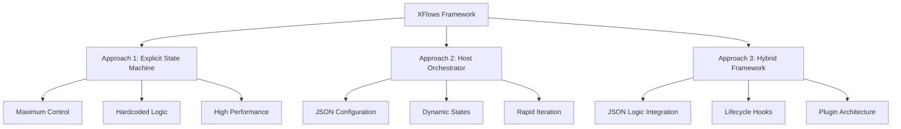

# XFlows Architecture Guide

## Executive Summary

XFlows implements three architectural approaches for sales channel orchestration, each optimized for different use cases and requirements. This guide provides comprehensive analysis and recommendations for selecting the appropriate approach.

---

## Table of Contents

- [Architecture Overview](#architecture-overview)
- [Approach 1: Explicit State Machine](#approach-1-explicit-state-machine)
- [Approach 2: Host Orchestrator](#approach-2-host-orchestrator)
- [Approach 3: Hybrid Framework](#approach-3-hybrid-framework)
- [Comparison Matrix](#comparison-matrix)
- [Selection Criteria](#selection-criteria)
- [Implementation Examples](#implementation-examples)
- [Migration Strategies](#migration-strategies)

---

## Architecture Overview

XFlows supports three distinct architectural patterns, each offering unique trade-offs between flexibility, maintainability, and performance:



---

## Approach 1: Explicit State Machine

### Overview

The XState-native approach implementation provides maximum control with all flow logic explicitly defined in TypeScript.

### Characteristics

- **States**: Fixed, hardcoded state definitions
- **Transitions**: Explicit transition logic in code
- **Context**: Strongly typed context with specific interfaces
- **Guards**: Hardcoded guard functions
- **Actions**: Specific action implementations

### Implementation Example

```typescript
const salesFlowMachine = createMachine({
  id: 'salesFlow',
  initial: 'quickQuote',
  context: {
    dossierId: null as string | null,
    riskScore: 0,
    applicantId: null as string | null,
    signatureId: null as string | null,
    policyId: null as string | null,
    errors: [] as string[],
    session: { channel: 'web', userId: null },
    results: {} as Record<string, any>
  },
  states: {
    quickQuote: {
      meta: { view: { moduleId: '7006-quickquote' } },
      on: {
        QUICKQUOTE_SUBMIT: {
          target: 'riskDecision',
          actions: assign({ dossierId: () => `document-${Date.now()}` })
        }
      }
    },
    riskDecision: {
      meta: { view: { moduleId: 'risk-assessor' } },
      on: {
        CALCULATE_RISK: 'riskDecision',
        CONTINUE_LOW_RISK: 'notifyingProgress2',
        CONTINUE_HIGH_RISK: 'highRisk'
      }
    }
  },
  guards: { 
    isHighRisk: (context) => context.riskScore > 80 
  }
});
```

### Strengths

✅ **Maximum Control** - Complete authority over flow behavior  
✅ **Type Safety** - Full TypeScript support with strong typing  
✅ **Performance** - Optimized compiled machine definitions  
✅ **Debugging** - Clear state transitions and explicit logic  
✅ **Testing** - Predictable behavior for unit testing  

### Limitations

❌ **Fixed Logic** - Hardcoded business rules require code changes  
❌ **Maintenance Overhead** - Significant code for flow modifications  
❌ **Scalability** - More states require proportionally more code  
❌ **Team Dependency** - Requires developers for configuration changes  

### Optimal Use Cases

- **Complex Critical Flows** - Payment processing, high-risk operations
- **Performance-Critical Systems** - Where minimal latency is essential
- **Stable Business Logic** - Well-established processes that rarely change
- **Technical Teams** - Organizations with strong development capabilities

---

## Approach 2: Host Orchestrator

### Overview

JSON-driven configuration approach that creates XState machines dynamically from declarative definitions.

### Characteristics

- **States**: Generated from JSON configuration
- **Transitions**: Declared as JSON structures
- **Context**: Flexible context binding system
- **Guards**: String-based guard expressions
- **Actions**: Generated from action declarations

### Implementation Example

```typescript
const salesFlowMachineSimple = createFlowMachine({
  id: 'salesFlow',
  initial: 'quote.start',
  context: {
    session: { channel: 'web', userId: null },
    quote: {},
    errors: {},
  },
  states: {
    'quote.start': {
      view: { moduleId: 'mfe-quote-start', slot: 'main' },
      bind: [{ from: 'query.token', to: 'session.token' }],
      invoke: [{
        id: 'loadUser',
        type: 'http',
        config: { url: '/bff/user', method: 'GET' },
        assignTo: 'session.user'
      }],
      on: {
        NEXT: {
          target: 'quote.coverage',
          actions: [{
            type: 'assign',
            to: 'quote.basic',
            fromEventPath: 'payload.basic'
          }]
        }
      }
    }
  }
});
```

### Strengths

✅ **Rapid Configuration** - Fast flow modifications via JSON  
✅ **Business User Friendly** - Non-technical configuration possible  
✅ **Scalable** - Add states without proportional code increase  
✅ **A/B Testing** - Easy flow variations for experimentation  
✅ **Dynamic Flows** - Runtime flow configuration changes  

### Limitations

❌ **Limited Logic** - Constrained to predefined behavior patterns  
❌ **Type Safety** - Reduced compile-time validation  
❌ **Performance** - Runtime configuration parsing overhead  
❌ **Debugging** - Dynamic behavior harder to trace  

### Optimal Use Cases

- **Marketing Campaigns** - Fast-changing promotional flows
- **User Onboarding** - Frequently updated customer journeys
- **A/B Testing** - Multiple flow variations for optimization
- **Multi-Channel Systems** - Different flows for different channels

---

## Approach 3: Hybrid Framework

### Overview

Advanced hybrid approach combining the strengths of both previous approaches with powerful business logic capabilities.

### Characteristics

- **States**: JSON-like configuration with intelligent processing
- **Transitions**: Dynamic transitions with lifecycle hooks
- **Context**: Smart data binding with validation
- **Guards**: JSON Logic expressions for complex conditions
- **Actions**: EJS templating with dynamic data binding

### Implementation Example

```typescript
const hybridFlow = createHybridFlowMachine({
  id: 'insuranceSales',
  initial: 'initialization',
  context: {
    dossierId: null,
    riskScore: 0,
    session: { channel: 'web', userId: null }
  },
  
  states: {
    initialization: {
      type: 'atomic',
      meta: {
        view: { moduleId: 'mfe-initialization' },
        description: 'Flow initialization',
        icon: '🚀'
      },
      
      lifecycle: {
        onEnter: ['logInitialization', 'setupSession'],
        onExit: ['logInitializationComplete']
      },
      
      binding: {
        inputs: [
          { source: 'url.query.token', target: 'session.token' },
          { source: 'url.query.channel', target: 'session.channel' }
        ]
      },
      
      invoke: [{
        id: 'loadUserSession',
        src: 'httpRequest',
        input: {
          url: '/api/user/profile',
          headers: { 'Authorization': 'Bearer session.token' }
        },
        onDone: {
          target: 'quote.start',
          actions: ['assignUserData']
        }
      }]
    },
    
    'quote.validation': {
      type: 'atomic',
      
      // JSON Logic for complex validations
      logic: {
        conditions: [
          {
            name: 'validAgeForLifeInsurance',
            expression: {
              "and": [
                {">": [{"var": "applicant.age"}, 18]},
                {"<=": [{"var": "applicant.age"}, 70]},
                {"==": [{"var": "quote.type"}, "life"]}
              ]
            }
          }
        ],
        
        computed: [
          {
            field: 'quote.validationStatus',
            expression: {
              "if": [
                {"var": "condition.validAgeForLifeInsurance"},
                "approved",
                "pending_review"
              ]
            }
          }
        ]
      },
      
      // Dynamic UI with EJS templates
      ui: {
        title: 'Validation for <%= context.quote?.type || "quote" %>',
        fields: [
          {
            name: 'premium',
            template: 'Premium: $<%= context.quote?.premium?.toLocaleString() %>',
            visibility: { "!=": [{"var": "quote.premium"}, null] }
          }
        ],
        buttons: [
          {
            text: 'Continue',
            event: 'CONTINUE',
            enabled: {
              "and": [
                {"!=": [{"var": "applicant.age"}, null]},
                {">": [{"var": "quote.coverageAmount"}, 0]}
              ]
            }
          }
        ]
      }
    }
  },
  
  // Plugin integration
  plugins: {
    tools: {
      'document-uploader': {
        id: 'aws-s3-upload',
        config: {
          bucket: 'insurance-documents',
          keyTemplate: 'policies/{{dossierId}}/{{filename}}'
        },
        enabled: true
      }
    },
    
    ui: {
      'metrics-dashboard': {
        id: 'aws-cloudwatch',
        config: {
          namespace: 'Insurance/Processing',
          metrics: ['DocumentUploadTime', 'ProcessingRate']
        },
        enabled: true
      }
    }
  },
  
  guards: {
    isLowRisk: 'greaterThan:context.riskScore:80',
    isHighRisk: 'lessThan:context.riskScore:30'
  },
  
  actions: {
    logInitialization: 'log:Session initialization started',
    assignUserData: 'assignField:field:session.user',
    generateDossierId: 'generateId:field:dossierId:prefix:dossier'
  }
});
```

### Strengths

✅ **Advanced Logic** - JSON Logic for complex business rules  
✅ **Dynamic UI** - EJS templates for personalized interfaces  
✅ **Complete Lifecycle** - Explicit hooks for state management  
✅ **Plugin Architecture** - Extensible actor, UI, tool, guard, action system  
✅ **Type Safety** - Strong TypeScript support with flexible configuration  
✅ **Performance** - Optimized runtime with intelligent caching  
✅ **Maintainability** - Business logic changes without code deployment  

### Advanced Features

**JSON Logic Integration**
```typescript
// Complex business rule example
const riskAssessmentRule = {
  "if": [
    {"==": [{"var": "quote.type"}, "life"]},
    {    // Life insurance specific rules
      "and": [
        {">=": [{"var": "applicant.age"}, 18]},
        {"<=": [{"var": "applicant.age"}, 70]},
        {"<=": [{"var": "riskScore"}, 80]}
      ]
    },
    {    // Other insurance types
      "and": [
        {">=": [{"var": "applicant.age"}, 18]},
        {"<=": [{"var": "applicant.age"}, 75]},
        {"<=": [{"var": "riskScore"}, 85]}
      ]
    }
  ]
};
```

**Dynamic UI Generation**
```typescript
// Adaptive form fields based on context
{
  fields: [
    {
      name: 'rfc_field',
      type: 'input',
      label: 'RFC (Mexican Tax ID)',
      visibility: {
        "==": [{"var": "applicant.country"}, "MEX"]
      },
      required: {
        "and": [
          {"==": [{"var": "applicant.country"}, "MEX"]},
          {">": [{"var": "quote.coverageAmount"}, 50000]}
        ]
      }
    }
  ]
}
```

### Limitations

❌ **Complexity** - Steeper learning curve than simpler approaches  
❌ **Cognitive Load** - More concepts to understand and master  
❌ **Debugging** - Complex logic expressions require specialized tools  

---

## Comparison Matrix

| Aspect | Approach 1: Explicit | Approach 2: Host Orchestrator | **Approach 3: Hybrid** |
|--------|----------------------|--------------------------------|------------------------|
| **Flexibility** | 🔴 Low - Fixed states | 🟢 High - Dynamic JSON | 🟢 **Maximum - JSON Logic** |
| **Lifecycle Management** | 🟡 Manual hooks | 🔴 Limited hooks | 🟢 **Complete lifecycle** |
| **Type Safety** | 🟢 Strong TypeScript | 🟡 Partial typing | 🟢 **Strong with flexibility** |
| **Maintenance** | 🔴 High overhead | 🟢 Low JSON changes | 🟢 **Minimal overhead** |
| **Performance** | 🟢 Excellent | 🟡 Good with overhead | 🟢 **Excellent optimized** |
| **Debugging** | 🟢 Clear states | 🟡 Dynamic behavior | 🟢 **Advanced tools** |
| **Business Logic** | 🔴 Hardcoded | 🔴 Simple conditions | 🟢 **JSON Logic expressions** |
| **UI Adaptation** | 🔴 Static | 🔴 Static | 🟢 **Dynamic EJS templates** |
| **Plugin System** | 🔴 None | 🔴 None | 🟢 **Complete architecture** |
| **Enterprise Features** | 🔴 Basic | 🔴 Basic | 🟢 **AWS, Google, Microsoft** |

---

## Selection Criteria

### Choose Approach 1 When:

✅ **Critical Systems** - Payment, security, or compliance flows  
✅ **Performance Priority** - Ultra-low latency requirements  
✅ **Stable Business Logic** - Rarely changing workflows  
✅ **Strong Technical Team** - Experienced developers available  
✅ **Predictable Behavior** - Simple, linear flow patterns  

**Example Use Cases:**
- Banking transaction processing
- Military/government security workflows
- Real-time trading systems
- Critical infrastructure operations

### Choose Approach 2 When:

✅ **Marketing Campaigns** - Frequently changing promotional flows  
✅ **User Onboarding** - Customer journey optimization  
✅ **A/B Testing** - Multiple flow variations  
✅ **Non-Technical Users** - Business users configure flows  
✅ **Rapid Iteration** - Fast response to market changes  

**Example Use Cases:**
- E-commerce checkout flows
- Customer onboarding sequences
- Marketing automation campaigns
- Call center scripts

### Choose Approach 3 When:

✅ **Enterprise Systems** - Complex business requirements  
✅ **Multi-Channel Operations** - Different flows for different markets  
✅ **Advanced Analytics** - Sophisticated tracking needs  
✅ **Plugin Ecosystem** - Need for third-party integrations  
✅ **Dynamic Business Rules** - Complex validation requirements  

### Choose Approach 3 When:

✅ **Enterprise Systems** - Complex business requirements  
✅ **Multi-Channel Operations** - Different flows for different markets  
✅ **Advanced Analytics** - Sophisticated tracking needs  
✅ **Plugin Ecosystem** - Need for third-party integrations  
✅ **Dynamic Business Rules** - Complex validation requirements  

**Example Use Cases:**
- Insurance quote systems
- Healthcare patient workflows
- Financial services applications
- B2B sales automation platforms

---

## Implementation Examples

### Insurance Quote Flow (Approach 3)

```typescript
const insuranceFlow = createHybridFlowMachine({
  id: 'insuranceQuote',
  initial: 'applicant.data',
  
  states: {
    'applicant.data': {
      ui: {
        title: 'Applicant Information',
        fields: [
          {
            name: 'age',
            type: 'number',
            required: true,
            validation: {
              "and": [
                {">=": [{"var": "applicant.age"}, 18]},
                {"<=": [{"var": "applicant.age"}, 80]}
              ]
            }
          },
          {
            name: 'rfc',
            type: 'text',
            visibility: {
              "==": [{"var": "applicant.country"}, "MEX"]
            },
            validation: {
              "if": [
                {"==": [{"var": "applicant.country"}, "MEX"]},
                {"regex": [{"var": "applicant.rfc"}, "^[A-Z]{4}[0-9]{6}[A-Z0-9]{3}$"]},
                true
              ]
            }
          }
        ]
      },
      
      on: {
        SUBMIT: {
          target: 'risk.assessment',
          guard: 'hasValidApplicantData'
        }
      }
    },
    
    'risk.assessment': {
      invoke: [{
        id: 'riskEngine',
        src: 'httpRequest',
        input: {
          url: '/api/risk/assess',
          method: 'POST',
          body: {
            age: '{{context.applicant.age}}',
            country: '{{context.applicant.country}}',
            coverageAmount: '{{context.quote.coverageAmount}}'
          }
        }
      }],
      
      logic: {
        computed: [
          {
            field: 'riskCategory',
            expression: {
              "if": [
                {">"><:[{"var": "riskScore"}, 80]}, "high",
                {">": [{"var": "riskScore"}, 60]}, "medium",
                "low"
              ]
            }
          },
          {
            field: 'premiumRate',
            expression: {
              "*": [
                {"var": "baseRate"},
                {
                  "if": [
                    {"==": [{"var": "riskCategory"}, "high"]}, 1.5,
                    {"==": [{"var": "riskCategory"}, "medium"]}, 1.2,
                    1.0
                  ]
                }
              ]
            }
          }
        ]
      },
      
      on: {
        RISK_CALCULATED: 'quote.display',
        RISK_ERROR: 'error.retry'
      }
    }
  },
  
  guards: {
    hasValidApplicantData: {
      "and": [
        {"!=": [{"var": "applicant.age"}, null]},
        {"!=": [{"var": "applicant.country"}, null]},
        {
          "if": [
            {"==": [{"var": "applicant.country"}, "MEX"]},
            {"!=": [{"var": "applicant.rfc"}, null]},
            true
          ]
        }
      ]
    }
  }
});
```

### E-commerce Checkout (Approach 2)

```typescript
const checkoutFlow = createFlowMachine({
  id: 'checkout',
  initial: 'shipping.address',
  
  states: {
    'shipping.address': {
      view: { moduleId: 'checkout-address' },
      on: {
        CONTINUE: 'payment.method'
      }
    },
    
    'payment.method': {
      view: { moduleId: 'checkout-payment' },
      on: {
        PAYMENT_COMPLETE: 'order.confirmation'
      }
    },
    
    'order.confirmation': {
      view: { moduleId: 'checkout-success' },
      type: 'final'
    }
  }
});
```

---

## Migration Strategies

### From Approach 1 to Approach 3

```typescript
// Before: Hardcoded state machine
const oldMachine = createMachine({
  states: {
    riskDecision: {
      invoke: {
        src: (context) => calculateRisk(context.userData),
        onDone: {
          target: 'riskEvaluated',
          actions: assign({ riskScore: (_, event) => event.data })
        }
      }
    }
  }
});

// After: Hybrid approach with JSON Logic
const newMachine = createHybridFlowMachine({
  states: {
    'risk.decision': {
      invoke: [{
        id: 'calculateRisk',
        src: 'httpRequest',
        input: {
          url: '/api/risk/calculate',
          method: 'POST',
          body: {
            userData: '{{context.userData}}',
            quoteType: '{{context.quote.type}}'
          }
        }
      }],
      
      logic: {
        computed: [
          {
            field: 'riskCategory',
            expression: {
              "if": [
                {">": [{"var": "riskScore"}, 80]}, "high",
                {">": [{"var": "riskScore"}, 60]}, "medium", 
                "low"
              ]
            }
          }
        ]
      },
      
      on: {
        RISK_CALCULATED: 'risk.evaluated',
        RISK_ERROR: 'risk.fallback'
      }
    }
  }
});
```

### From Approach 2 to Approach 3

```typescript
// Before: Simple JSON configuration
const simpleFlow = {
  states: {
    'quote.start': {
      view: { moduleId: 'quote-start' },
      on: { NEXT: 'quote.coverage' }
    }
  }
};

// After: Enhanced hybrid configuration
const enhancedFlow = {
  states: {
    'quote.start': {
      meta: {
        view: { moduleId: 'mfe-quote-start' },
        description: 'Initial quote configuration',
        icon: '💰'
      },
      
      lifecycle: {
        onEnter: ['logQuoteStart', 'bindQuoteData'],
        onExit: ['saveQuoteProgress']
      },
      
      binding: {
        inputs: [
          { source: 'url.query.token', target: 'session.token' },
          { source: 'localStorage.prefs', target: 'quote.preferences' }
        ]
      },
      
      ui: {
        title: 'Quote Configuration for <%= context.applicant?.name %>',
        fields: [
          {
            name: 'coverage',
            template: 'Coverage: $<%= context.quote?.coverageAmount?.toLocaleString() %>',
            visibility: { "!=": [{"var": "quote.coverageAmount"}, null] }
          }
        ]
      },
      
      on: {
        NEXT: {
          target: 'quote.coverage',
          actions: ['assignQuoteData'],
          guard: 'hasValidQuoteData'
        }
      }
    }
  },
  
  guards: {
    hasValidQuoteData: {
      "and": [
        {"!=": [{"var": "quote.coverageAmount"}, null]},
        {">": [{"var": "quote.coverageAmount"}, 0]},
        {"!=": [{"var": "applicant.age"}, null]}
      ]
    }
  }
};
```

---

## Conclusion

The XFlows architecture provides three distinct approaches optimized for different enterprise needs:

- **Approach 1** excels for critical, high-performance systems with stable requirements
- **Approach 2** is ideal for rapidly changing marketing and user onboarding flows  
- **Approach 3** represents the future of enterprise flow orchestration with advanced business logic capabilities

**Recommendation**: Start with Approach 3 for new implementations. Its hybrid architecture provides the flexibility to support any business requirement while maintaining enterprise-grade performance and extensibility through the plugin system.

The plugin architecture ensures that XFlows can grow with your business, integrating seamlessly with AWS, Google, Microsoft, and other enterprise services without requiring code changes.
