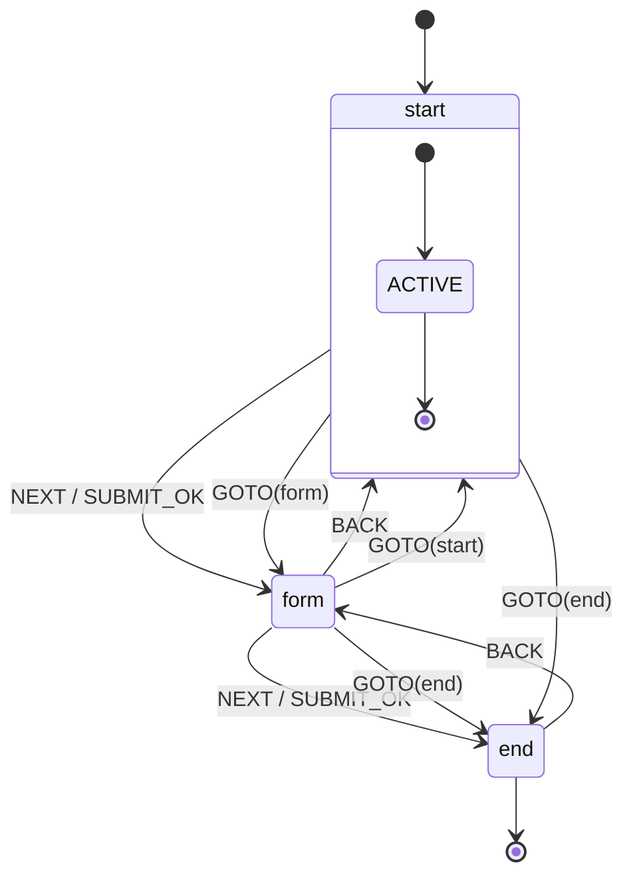
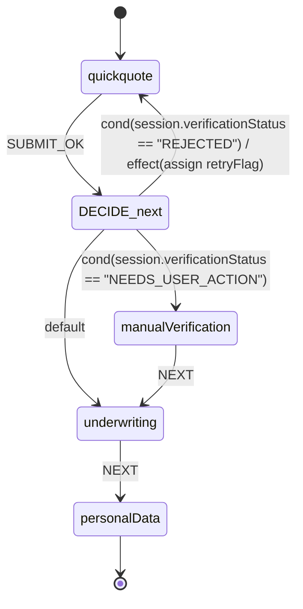
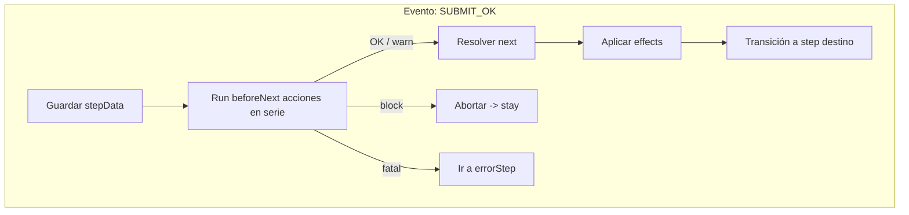
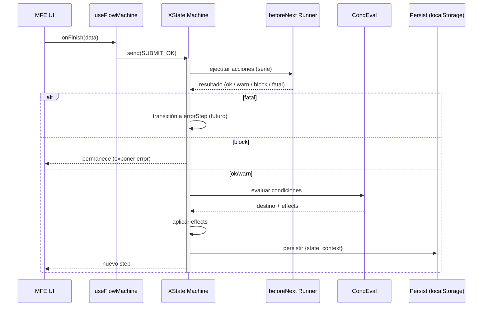
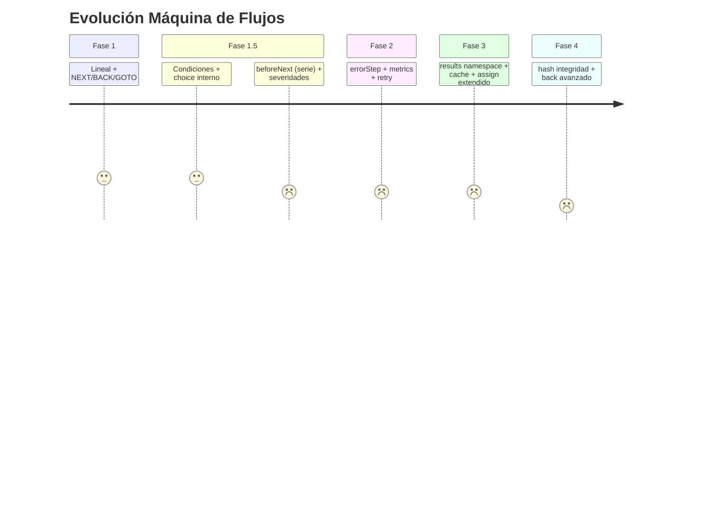

# XState Flow Machine – Diagramas Técnicos (Experimental)

Este documento visualiza el funcionamiento de la máquina de estados experimental basada en XState para los flows declarados en el DSL.

## 1. Patrón Base (Steps Lineales)
Representa un flow simple donde cada step tiene un `next` estático. Eventos soportados: `NEXT`, `SUBMIT_OK` (alias), `BACK`, `GOTO`.

Notas:
- Estados finales se marcan sin transición `NEXT`.
- `BACK` toma el último valor real del stack (no se muestra toda la pila en el diagrama para simplicidad).
- `GOTO` se valida contra el conjunto de ids.

## 2. Patrón con Transición Condicional (`next` objeto)
Se modela como un micro-estado de decisión interno (no expuesto al host) antes de saltar al destino.

Mapping:
- El bloque `choice` representa la evaluación secuencial de `conditions` → primera que devuelve true.
- `default` es ruta fallback obligatoria (fail fast si falta).
- `effects` (assign) se aplican antes de la transición real.

## 3. Integración Futura del Pipeline `beforeNext`
El pipeline se invoca antes de resolver la transición. Si aparece severidad `fatal` se desvía a `errorStep` (cuando exista). Si `block`, se aborta la transición y se permanece en el step.

### Secuencia detallada (Mermaid Sequence)

## 4. Estados Implícitos / Meta
| Concepto | Descripción | Estado explícito | Implementación | Fase |
|----------|-------------|------------------|----------------|------|
| Decisión condicional | Nodo `choice` interno | No | Guard + evaluación en transición | 1.5 |
| Pipeline ejecución | Paso previo a transición | No | `invoke`/acciones encadenadas antes del cambio | 1.5 |
| Error global | Redirige en `fatal` | Sí (errorStep) | Estado final alterno | 2 |
| Loading paso | Espera de fetch MFE/vista | Opcional | Metadato + spinner en UI | 2 |

## 5. Eventos y Guards Planeados
| Evento | Origen | Guard (ejemplo) | Acción | Resultado |
|--------|--------|-----------------|--------|-----------|
| SUBMIT_OK | MFE | formValid? | pushHistory + pipeline | Avanza / aborta |
| NEXT | Botón host | n/a (o formValid) | pushHistory | Avanza |
| BACK | Botón host | allowBack? | popHistory | Retrocede |
| GOTO | Externo / SignalR | stepExists? | pushHistory | Salta |
| ERROR | Acciones | always | set error meta | (futuro) |

## 6. Persistencia
- Clave: `xflow:<flowId>`.
- Contenido: `{ state: <currentStep>, context: { data, history } }`.
- Rehidratación: antes de crear actor, se inyecta en `withContext`.

## 7. Métricas (Futuras)
| Métrica | Momento | Etiquetas |
|---------|---------|-----------|
| flow_transition_total | Cada cambio de step | flowId, from, to, cause(NEXT|SUBMIT_OK|GOTO|BACK) |
| flow_pipeline_duration_ms | Pipeline beforeNext | flowId, stepId |
| flow_pipeline_failure_total | Acción fallida | severity |
| flow_conditional_branch_total | Resolución condicional | branchId, matched(true/false) |

## 8. Roadmap Visual (Resumen)

## 9. Convenciones
- Un step = un estado XState plano (sin jerarquía anidada por ahora).
- Condicional = guard + `choice` conceptual (no se modela nodo explícito salvo si migramos a `choose` pattern).
- Mutaciones de contexto sólo vía effects definidos.
- History lineal (no se duplican ids consecutivos).

## 10. Próximos Artefactos
| Archivo | Descripción | Estado |
|---------|-------------|--------|
| `adapters/dslToMachine.ts` | Traduce `next` objeto a guards | Pendiente |
| `machine/pipeline.ts` | Runner beforeNext secuencial | Pendiente |
| `machine/guards.ts` | Guards reusables (formValid, allowBack) | Pendiente |
| `machine/actions.ts` | Acciones side-effects (log, metrics) | Pendiente |

---
Cualquier ajuste visual que necesites (añadir estados intermedios explícitos, colores, etc.) lo puedo incorporar.
