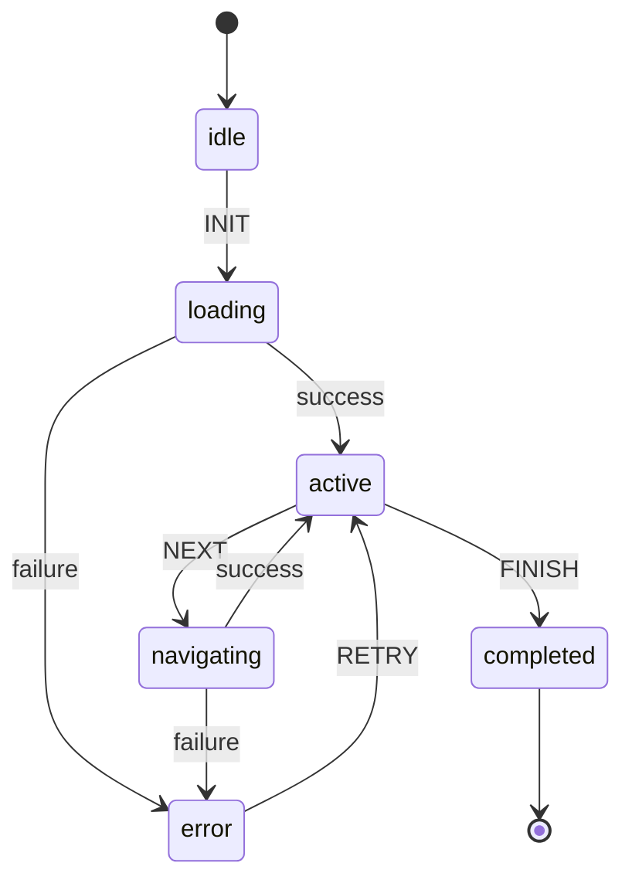
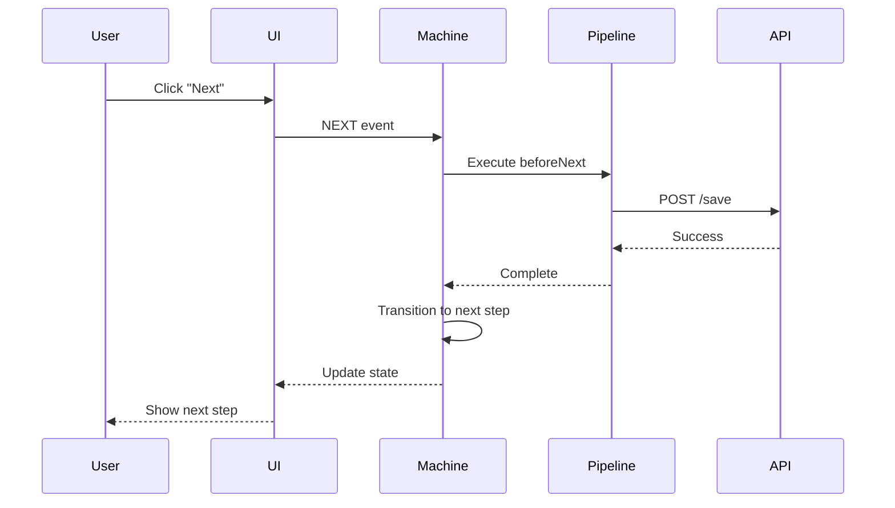
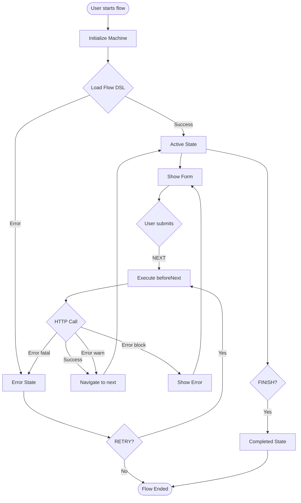

# 📊 Diagramas XState Flow

Esta sección contiene todos los diagramas visuales de la state machine y sus flujos.

---

## 📚 Diagramas Disponibles

### Diagramas Principales

- **[XFlow Machine Diagrams](xflow-machine-diagram.md)** ⭐
  - Estado general de la máquina
  - Transiciones entre estados
  - Guards y conditions
  - Actions y efectos
  - Pipeline de beforeNext
  - Casos de error

---

## 🎯 Tipos de Diagramas

### State Diagrams (Mermaid)

Visualización de la máquina de estados con todos sus estados y transiciones.



### Sequence Diagrams

Visualización de flujos de interacción entre componentes.



### Flow Diagrams

Visualización de flujos de decisión y navegación.



---

## 🔍 Cómo Usar los Diagramas

### Visualización en Docsify

Los diagramas Mermaid se renderizan automáticamente en Docsify. Solo necesitas:

1. Incluir el plugin de Mermaid en `index.html`
2. Usar bloques de código con tipo `mermaid`

### Exportar a Imagen

Para exportar diagramas como imágenes:

1. **Mermaid Live Editor**: https://mermaid.live
2. Pegar el código del diagrama
3. Exportar como PNG/SVG

### Editar Diagramas

Para editar diagramas existentes:

1. Abrir el archivo `.md` correspondiente
2. Modificar el código Mermaid
3. Preview en Docsify o Mermaid Live Editor
4. Commit los cambios

---

## 📝 Crear Nuevos Diagramas

### Plantilla de Diagrama

```markdown
# Título del Diagrama

**Descripción**: Breve descripción del diagrama

---

## Diagrama

\`\`\`mermaid
graph TD
    A[Start] --> B[Process]
    B --> C[End]
\`\`\`

---

## Explicación

Explicación detallada de cada elemento del diagrama.

---

## Referencias

- [Link a documentación relacionada]
```

### Convenciones

- **Estados**: Nombres en minúsculas (`idle`, `active`, `error`)
- **Eventos**: Nombres en MAYÚSCULAS (`NEXT`, `FINISH`, `RETRY`)
- **Guards**: Formato `canXxx` (`canProceed`, `hasErrors`)
- **Actions**: Formato `verbNoun` (`updateContext`, `persistState`)

---

## 🎓 Recursos de Mermaid

### Documentación Oficial

- [Mermaid Documentation](https://mermaid.js.org/)
- [State Diagrams](https://mermaid.js.org/syntax/stateDiagram.html)
- [Sequence Diagrams](https://mermaid.js.org/syntax/sequenceDiagram.html)
- [Flowcharts](https://mermaid.js.org/syntax/flowchart.html)

### Herramientas

- [Mermaid Live Editor](https://mermaid.live)
- [VS Code Extension](https://marketplace.visualstudio.com/items?itemName=bierner.markdown-mermaid)

---

## 🔗 Enlaces Relacionados

- [XState Documentation](../README.md)
- [State Machine](../xstate-state-machine.md)
- [Flow Events](../flow-events-reference.md)
- [Architecture Overview](../../architecture/README.md)

---

<p align="center">
  <strong>Última actualización:</strong> 3 de octubre de 2025
</p>
